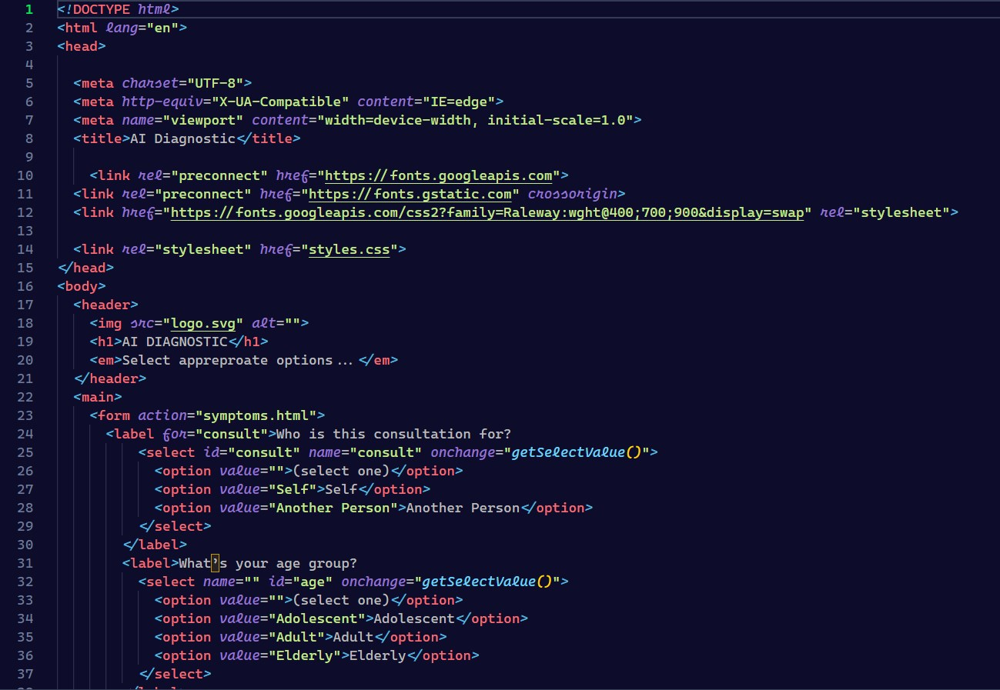
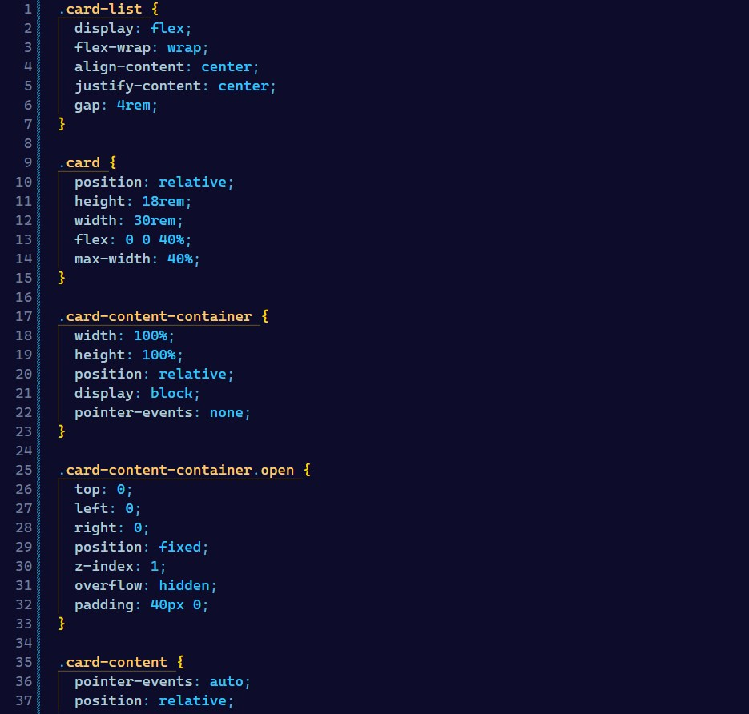
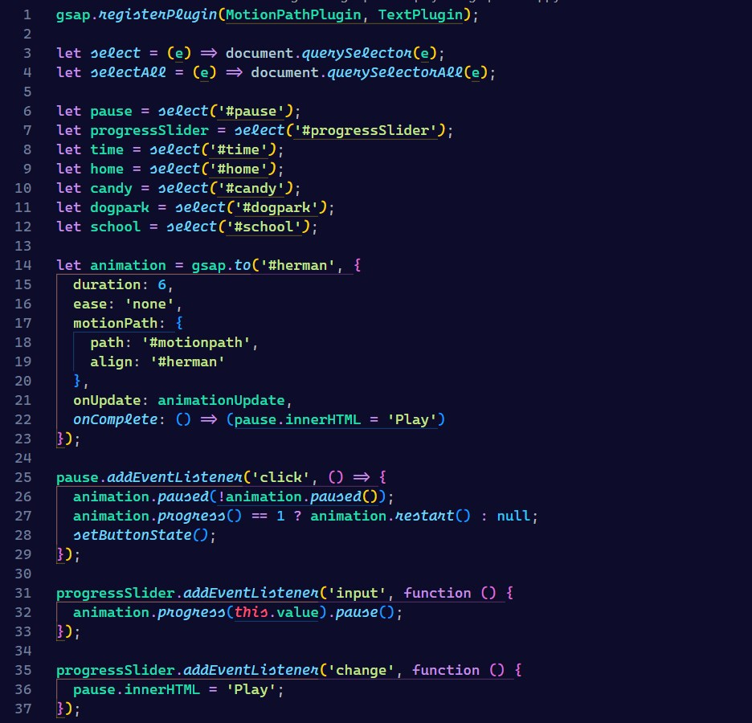

# Dark Jazz

## Introduction

These Visual Studio Code Theme was carefully designed for all dark mode developers. I love dark mode alot and i think you all will appreciate this theme.

If you like this theme kindly give it a 5⭐ in vs code marketplace.

## Screenshot

### HTML

### CSS

### JS

### React

## Installation

1.  Install 
2.  Launch Visual Studio Code
3.  Choose Extensions from menu
4.  Search for **Dark Jazz**
5.  Click Install to install it
6.  Click Reload to reload the Code
7.  From the menu bar click: Code > Preferences > Color Theme > __Dark Jazz__

**Enjoy!**
